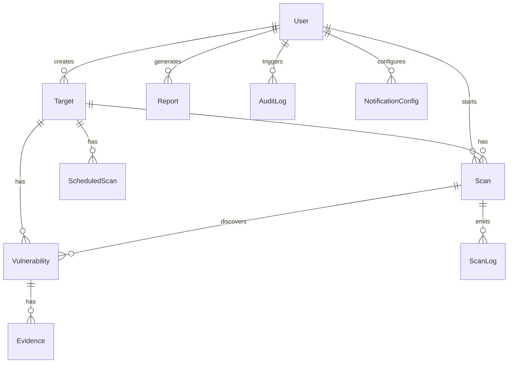

# VibeCode — Architecture Documentation

> **Enterprise Web Application Penetration Testing Platform**
> Version 1.0 | Updated 2026-02-24

---

## Tech Stack

| Layer | Technology |
|-------|-----------|
| **Frontend** | Next.js 14 (App Router), React 18, TailwindCSS 3 |
| **API** | tRPC v11 (RC) with SuperJSON serialization |
| **Database** | SQLite via Prisma ORM (v6) |
| **Auth** | JWT (jose) + bcryptjs password hashing |
| **Scanner** | Custom Node.js engine (crawler + 11 detector modules) |
| **Headless Browser** | Puppeteer + puppeteer-extra-plugin-stealth |
| **HTML Parser** | Cheerio (server-side DOM) |
| **UI** | Lucide icons, Recharts, date-fns |

---

## Directory Structure

```
pentest/
├── prisma/
│   ├── schema.prisma          # 10 models — full pentest data model
│   └── seed.ts                # Default admin/pentester users + sample target
├── src/
│   ├── app/
│   │   ├── globals.css        # Design system (glassmorphism dark theme)
│   │   ├── layout.tsx         # Root layout with font + providers
│   │   ├── page.tsx           # Landing / redirect to dashboard
│   │   ├── login/page.tsx     # Login page
│   │   ├── api/trpc/[trpc]/route.ts  # tRPC HTTP handler
│   │   └── (platform)/       # Authenticated app routes
│   │       ├── layout.tsx     # Sidebar + top nav shell
│   │       ├── dashboard/     # Dashboard with stats + charts
│   │       ├── targets/       # Target CRUD (list, detail, new)
│   │       ├── scans/         # Scan management (list, detail, new)
│   │       ├── vulnerabilities/ # Vulnerability browser + detail
│   │       ├── reports/       # Report generation + downloads
│   │       └── settings/      # Platform settings
│   ├── components/
│   │   └── providers.tsx      # tRPC + React Query providers
│   ├── lib/
│   │   ├── auth.ts            # JWT sign/verify, token extraction, RBAC
│   │   ├── cvss.ts            # CVSS v3.1 calculator + common vectors
│   │   ├── cwe-database.ts    # 200+ CWE entries (id → title/desc/severity)
│   │   ├── prisma.ts          # Prisma client singleton
│   │   └── utils.ts           # HTTP artifact builders, shared helpers
│   ├── scanner/
│   │   ├── index.ts              # Scan orchestrator (entry point)
│   │   ├── crawler.ts            # HTTP-based URL/form/param discovery
│   │   ├── headless-browser.ts   # Stealth Chromium manager (anti-fingerprint)
│   │   ├── headless-crawler.ts   # SPA-aware JS-rendered crawling
│   │   ├── payloads.ts           # 52KB payload engine + context generators
│   │   ├── detectors.ts          # 7 standard OWASP detectors
│   │   ├── advanced-detectors.ts # 4 elite red-team detectors
│   │   ├── easm.ts               # External Attack Surface Management
│   │   ├── cloud-exploit.ts      # Cloud/container/CI-CD exploitation
│   │   ├── cognitive-exploit.ts  # AI-assisted fuzzing + business logic
│   │   ├── post-exploit.ts       # Post-exploitation evidence gathering
│   │   └── data/                 # External payload databases
│   │       ├── xss-payloads.json    # 845KB — PayloadsAllTheThings XSS
│   │       ├── sqli-payloads.json   # 95KB — PayloadsAllTheThings SQLi
│   │       └── dorks.json           # 8KB — Google dork patterns
│   ├── server/
│   │   ├── trpc.ts            # tRPC init, middleware (auth, roles)
│   │   ├── context.ts         # Request context (prisma + user)
│   │   ├── root.ts            # Root router (merges all sub-routers)
│   │   └── routers/
│   │       ├── auth.ts        # Login, logout, register, profile
│   │       ├── target.ts      # Target CRUD + config
│   │       ├── scan.ts        # Scan CRUD + execution
│   │       ├── vulnerability.ts # Vulnerability queries + status
│   │       ├── dashboard.ts   # Dashboard stats + charts
│   │       └── report.ts      # Report generation (MD/JSON/HTML)
│   ├── trpc/
│   │   └── client.ts          # tRPC React client (createTRPCReact)
│   └── types/
│       └── index.ts           # Shared TypeScript types (15+ const enums)
├── .env                       # Environment configuration
├── next.config.mjs            # Next.js config (security headers, CSP)
├── tailwind.config.ts         # Tailwind config (custom brand/surface colors)
├── tsconfig.json              # TypeScript config with path aliases
└── package.json               # Dependencies and scripts
```

---

## Prisma Schema (10 Models)



| Model | Purpose |
|-------|---------|
| `User` | Auth (admin, security_lead, pentester, developer, viewer), MFA support |
| `Target` | Assets to scan (URL, auth config, rate limits, crawl settings) |
| `Scan` | Individual scan jobs (status, progress, vuln counts, timing) |
| `ScanLog` | Per-scan execution trace (debug/info/warn/error per module) |
| `Vulnerability` | Core findings — 30+ fields (see below) |
| `Evidence` | Artifacts per vulnerability (request/response, screenshots, DOM) |
| `ScheduledScan` | Cron-based recurring scans |
| `Report` | Generated reports (MD/HTML/JSON with evidence bundle) |
| `AuditLog` | Platform activity tracking (action, IP, user agent) |
| `NotificationConfig` | Alert channels (email, Slack, Discord, Teams, webhook) |

### Vulnerability Model — Key Fields

| Group | Fields |
|-------|--------|
| **Identity** | id, targetId, scanId, category, subcategory |
| **Classification** | cweId, mappedCveIds, mappedOwasp, mappedAsvs, mappedNist |
| **Scoring** | severity, cvssScore, cvssVector, confidence |
| **Location** | affectedUrl, httpMethod, parameter, parameterType, injectionPoint |
| **Evidence** | payload, requestArtifact, responseArtifact, screenshotPath, domSnapshot |
| **Analysis** | description, technicalDetails, impact, remediationSteps, reproductionSteps |
| **Red-Team** | attackChainGraph, raceConditionConfirmed, cloudMetadataExtracted, cachePoisoningImpact, chainedFrom |
| **EASM** | assetDiscoveryPath, internalNetworkExposure, extractedCloudSecrets, postExploitationEvidence, sourceMapReconstructed |
| **Status** | status (open/confirmed/fixed/false_positive/accepted/reopened) |

---

## tRPC Router API Reference

### `auth` Router
| Procedure | Type | Auth | Description |
|-----------|------|------|-------------|
| `login` | mutation | public | Email/password → JWT cookie |
| `logout` | mutation | protected | Clear auth cookie |
| `register` | mutation | admin | Create new user account |
| `me` | query | protected | Get current user profile |

### `target` Router
| Procedure | Type | Auth | Description |
|-----------|------|------|-------------|
| `list` | query | protected | Paginated targets with filters |
| `getById` | query | protected | Single target with scan count |
| `create` | mutation | pentester | Create new target |
| `update` | mutation | pentester | Update target config |
| `delete` | mutation | admin | Delete target + cascade |

### `scan` Router
| Procedure | Type | Auth | Description |
|-----------|------|------|-------------|
| `list` | query | protected | Paginated scans with filters |
| `getById` | query | protected | Scan detail with logs + vulns |
| `create` | mutation | pentester | Launch new scan |
| `cancel` | mutation | pentester | Cancel running scan |
| `getLogs` | query | protected | Stream scan execution logs |

### `vulnerability` Router
| Procedure | Type | Auth | Description |
|-----------|------|------|-------------|
| `list` | query | protected | Paginated vulns with severity/category filters |
| `getById` | query | protected | Full vuln detail with evidence |
| `updateStatus` | mutation | pentester | Change status (open/confirmed/fixed/etc.) |

### `dashboard` Router
| Procedure | Type | Auth | Description |
|-----------|------|------|-------------|
| `stats` | query | protected | Card stats (targets, scans, vulns by severity) |
| `recentScans` | query | protected | Latest scan activity |
| `severityTrend` | query | protected | Severity trend data for charts |

### `report` Router
| Procedure | Type | Auth | Description |
|-----------|------|------|-------------|
| `generate` | mutation | pentester | Generate report from scan data (MD/JSON/HTML) |
| `list` | query | protected | List previous reports |
| `getById` | query | protected | Get report with content |
| `download` | query | protected | Get report content for download |

---

## Scanner Engine Architecture

```
┌──────────────────────────────────────────────────────────┐
│                  Scanner Orchestrator                      │
│                   (scanner/index.ts)                       │
├──────────┬────────────┬────────────┬─────────────────────┤
│          │            │            │                     │
│ Crawlers │  Standard  │  Advanced  │  Elite Modules      │
│          │  Detectors │  Detectors │                     │
├──────────┼────────────┼────────────┼─────────────────────┤
│ crawler  │  XSS       │  Race      │  easm.ts            │
│ .ts      │  SQLi      │  Condition │  (subdomain enum,   │
│          │  SSRF      │  HTTP      │   bucket hunting,   │
│ headless │  Headers   │  Desync    │   leaked secrets,   │
│ -browser │  CORS      │  Prototype │   shadow APIs)      │
│ .ts      │  PathTrav  │  Pollution │                     │
│          │  Redirect  │  Cloud     │  cloud-exploit.ts   │
│ headless │            │  SSRF      │  (container, SSRF   │
│ -crawler │            │            │   pivot, CI/CD)     │
│ .ts      │            │            │                     │
│          │            │            │  cognitive-exploit   │
│ payloads │  detectors │  advanced- │  .ts (AI fuzzing,   │
│ .ts      │  .ts       │  detectors │   business logic)   │
│          │            │  .ts       │                     │
│ data/    │            │            │  post-exploit.ts    │
│ (JSON)   │            │            │  (RCE evidence,     │
│          │            │            │   SQLi schema,      │
│          │            │            │   port scan)        │
└──────────┴────────────┴────────────┴─────────────────────┘
                      ↓ Results ↓
                ┌─────────────────────┐
                │  Prisma DB (SQLite) │
                │  Vulnerability +    │
                │  Evidence + ScanLog │
                └─────────────────────┘
```

### Scanner Flow

1. **Crawl Phase** — URL and parameter discovery
   - `crawler.ts` — HTTP-based link/form/param extraction using Cheerio
   - `headless-browser.ts` — Stealth Chromium with anti-fingerprint evasion:
     - WebDriver flag removal
     - Canvas/WebGL fingerprint randomization
     - Navigator property spoofing
     - CDP header cleanup
     - Realistic viewport and timezone
   - `headless-crawler.ts` — SPA-aware JS-rendered crawling:
     - Intercepts XHR/Fetch API calls for hidden endpoints
     - Monitors DOM mutations for dynamically added links
     - Extracts `window.postMessage` targets
     - Discovers WebSocket endpoints
   - Respects `maxCrawlDepth`, `maxUrls`, `rateLimit`, `requestTimeout`
   - Handles authentication (token, cookie, session, scripted login)

2. **Payload Engine** — `payloads.ts` + `data/`
   - 52KB inline payload database (XSS, SQLi, SSRF, SSTI, CMD, etc.)
   - External payload files from PayloadsAllTheThings:
     - `xss-payloads.json` — 845KB, context-tagged XSS payloads
     - `sqli-payloads.json` — 95KB, multi-dialect SQL injection
     - `dorks.json` — 8KB, Google dork patterns
   - Probe token generation for unique canary tracking
   - Context-aware payload selection based on parameter semantics

3. **Standard Detection Phase** — `detectors.ts` (7 modules)
   - **XSS** (CWE-79) — Reflected, Stored, DOM-based with context-aware payloads
   - **SQLi** (CWE-89) — Error-based, boolean-blind, time-based across MySQL/PostgreSQL/MSSQL/SQLite
   - **SSRF** (CWE-918) — Internal IP probing, redirect chain tracking, cloud metadata
   - **Security Headers** — CSP, HSTS, X-Frame-Options, referrer policy, permissions policy
   - **CORS** (CWE-942) — Origin reflection, null origin, wildcard with credentials
   - **Path Traversal** (CWE-22) — Directory traversal with encoding bypass
   - **Open Redirect** (CWE-601) — URL parameter redirect detection

4. **Advanced Detection Phase** — `advanced-detectors.ts` (4 modules)
   - **Race Condition** — HTTP/2 single-packet TOCTOU fuzzing, limit overrun
   - **HTTP Desync** — CL.TE and TE.CL request smuggling, web cache poisoning
   - **Prototype Pollution** — `__proto__` / `constructor.prototype` injection (client + server)
   - **Cloud Metadata SSRF** — AWS IMDSv1/v2, GCP, Azure, DigitalOcean, Kubernetes

5. **EASM Recon Phase** — `easm.ts`
   - Certificate Transparency log subdomain enumeration
   - Active DNS brute-forcing with permutation scanning
   - Cloud bucket hunting (S3, GCS, Azure Blob, DO Spaces)
   - Leaked secret scanning (15+ patterns: AWS, GitHub, Stripe, JWT, etc.)
   - Shadow API and orphaned endpoint discovery

6. **Cognitive Exploitation** — `cognitive-exploit.ts`
   - Context-aware payload generation based on parameter name semantics
   - Business logic flaw hypothesis and testing
   - Rate limit bypass detection
   - Price/quantity manipulation checks

7. **Cloud & Infrastructure** — `cloud-exploit.ts`
   - Container/Kubernetes exposure detection (Docker API, kubelet, etcd)
   - Advanced SSRF internal VPC pivoting (169.254.x.x, 10.0.0.0/8)
   - CI/CD webhook poisoning (Jenkins, GitHub Actions, GitLab CI)

8. **Post-Exploitation** — `post-exploit.ts`
   - RCE evidence gathering (safe commands: `whoami`, `id`, `uname -a`)
   - SQLi safe schema extraction (table/column names, sample rows only)
   - Internal port scanning via SSRF/SQLi proxy

9. **Storage** — All results written to DB with full evidence chain

---

## Authentication & Authorization

### Flow
```
Login → bcrypt.compare() → JWT signed (jose, HMAC-SHA256)
     → Set httpOnly cookie (vc_token)
     → Every tRPC request: extract token → verify → attach user to context
```

### Role Hierarchy
| Role | Level | Capabilities |
|------|-------|-------------|
| `viewer` | 0 | Read-only access to dashboards and results |
| `developer` | 1 | View vulnerabilities assigned to them |
| `pentester` | 2 | Create targets, launch scans, generate reports |
| `security_lead` | 3 | Full management + team oversight |
| `admin` | 4 | All operations + user management |

### tRPC Middleware Stack
- `publicProcedure` — No auth required (login, health)
- `protectedProcedure` — Must be authenticated
- `pentesterProcedure` — Must be pentester role or higher
- `adminProcedure` — Must be admin

---

## Vulnerability Classification

### Framework Mapping
Every vulnerability is mapped to:

| Framework | Coverage |
|-----------|----------|
| **CWE** | 200+ entries in `cwe-database.ts` |
| **CVSS v3.1** | Full vector + score calculator in `cvss.ts` |
| **OWASP Top 10** | All 10 categories mapped |
| **OWASP ASVS** | Level 2+ mapping |
| **NIST 800-53** | Control family mapping |
| **CVE** | Auto-matched via component version detection |

### Severity Levels
| Level | CVSS Range | Color |
|-------|-----------|-------|
| Critical | 9.0–10.0 | Red |
| High | 7.0–8.9 | Orange |
| Medium | 4.0–6.9 | Yellow |
| Low | 0.1–3.9 | Blue |
| Info | 0.0 | Gray |

---

## UI Design System

- **Theme**: Dark mode with glassmorphism (blur, semi-transparent cards)
- **Colors**: Indigo accent (`#6366f1`), dark backgrounds (`#0a0e1a` → `#1a2035`)
- **Typography**: Inter (UI) + JetBrains Mono (code)
- **Components**: `glass-card`, `stat-card`, `badge-{severity}`, `btn-primary`, `input-field`, `data-table`, `sidebar-link`
- **Charts**: Recharts (severity trend, vulnerability distribution)
- **Icons**: Lucide React

---

## Setup & Deployment

### Prerequisites
- Node.js 18+
- npm or pnpm
- Chrome/Edge browser (for headless SPA crawling)

### Quick Start
```bash
# Install dependencies and set up database
npm run setup

# Or step by step:
npm install
npx prisma generate
npx prisma db push
npx tsx prisma/seed.ts

# Start development server
npm run dev
```

### Environment Variables (`.env`)
```env
# Database (SQLite — auto created)
DATABASE_URL="file:./vibecode.db"

# JWT Secret (change in production!)
JWT_SECRET=vibecode-local-secret-key-change-in-production-2024

# App
NEXT_PUBLIC_APP_NAME=VibeCode
NEXT_PUBLIC_APP_URL=http://localhost:3000

# Scanner
SCANNER_MAX_CONCURRENT=5
SCANNER_REQUEST_TIMEOUT=30000
SCANNER_MAX_CRAWL_DEPTH=10
SCANNER_MAX_URLS=500
SCANNER_USER_AGENT=VibeCode-Scanner/1.0

# Evidence Storage
EVIDENCE_DIR=./evidence
```

### NPM Scripts
| Script | Command | Description |
|--------|---------|-------------|
| `dev` | `next dev` | Development server (http://localhost:3000) |
| `build` | `next build` | Production build |
| `start` | `next start` | Production server |
| `lint` | `next lint` | ESLint check |
| `db:generate` | `prisma generate` | Regenerate Prisma client |
| `db:push` | `prisma db push` | Push schema to database |
| `db:seed` | `tsx prisma/seed.ts` | Seed default data |
| `db:reset` | `prisma db push --force-reset && seed` | Reset and reseed |
| `db:studio` | `prisma studio` | Open Prisma Studio GUI |
| `setup` | Full setup chain | Install + generate + push + seed |

### Default Credentials
| Role | Email | Password |
|------|-------|----------|
| Admin | `admin@vibecode.local` | `admin123` |
| Pentester | `pentester@vibecode.local` | `pentester123` |

### Recommended Test Targets
| Name | URL | Notes |
|------|-----|-------|
| OWASP Juice Shop | `https://juice-shop.herokuapp.com` | Pre-seeded target |
| DVWA | `http://localhost/dvwa` | Self-hosted |
| WebGoat | `http://localhost:8080/WebGoat` | Self-hosted |

---

## Security Considerations

- **CSP Headers**: Strict Content-Security-Policy via `next.config.mjs`
- **HSTS**: Enabled with `includeSubDomains`
- **Frame Protection**: `X-Frame-Options: DENY`
- **XSS Protection**: Browser XSS filter enabled
- **Content-Type**: `X-Content-Type-Options: nosniff`
- **Referrer**: `Referrer-Policy: strict-origin-when-cross-origin`
- **Permissions**: `Permissions-Policy` restricting camera, mic, geolocation
- **JWT**: HttpOnly cookies, signed with HMAC-SHA256
- **Passwords**: bcrypt with 12 salt rounds
- **Role-based Access**: Enforced at tRPC middleware level
- **Audit Logging**: All sensitive actions logged to `AuditLog` table

---

## Dependencies

### Runtime
| Package | Version | Purpose |
|---------|---------|---------|
| next | 14.x | React framework |
| react / react-dom | 18.x | UI library |
| @prisma/client | 6.x | Database ORM |
| @trpc/server + client | 11.x-rc | Type-safe API |
| @tanstack/react-query | 5.x | Data fetching |
| jose | 5.x | JWT signing/verification |
| bcryptjs | 2.x | Password hashing |
| puppeteer | 24.x | Headless browser |
| puppeteer-extra + stealth | 3.x / 2.x | Anti-detection |
| cheerio | 1.x | HTML parsing |
| recharts | 2.x | Charts |
| lucide-react | 0.x | Icons |
| zod | 3.x | Schema validation |
| superjson | 2.x | Serialization |
| date-fns | 4.x | Date utilities |
| uuid | 11.x | ID generation |
| clsx | 2.x | Class merging |

### Dev
| Package | Version | Purpose |
|---------|---------|---------|
| typescript | 5.x | Type checking |
| prisma | 6.x | Schema management |
| tailwindcss | 3.x | CSS framework |
| tsx | 4.x | TS script runner |
| eslint + next config | 8.x | Linting |
